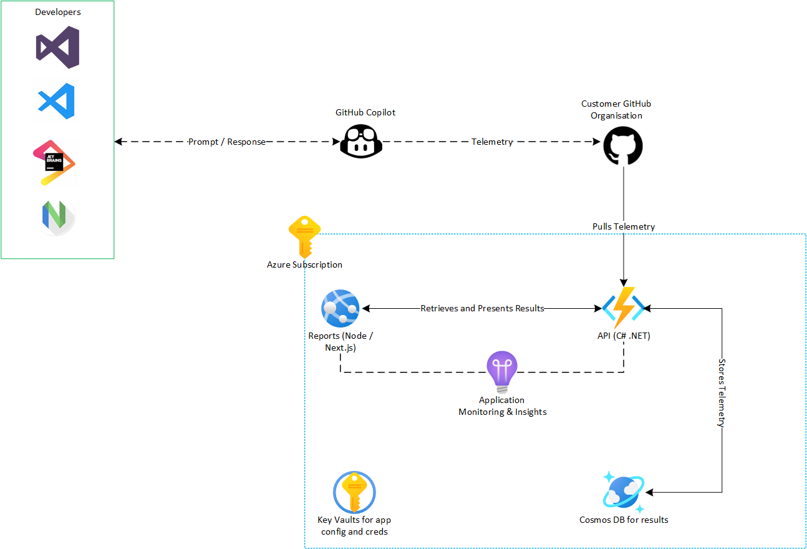

# GitHub Copilot Metrics Dashboard - Infrastructure

This directory contains the Infrastructure as Code (IaC) files for deploying the GitHub Copilot Metrics Dashboard to Azure using Bicep templates.

## Architecture Overview

The infrastructure deploys the following Azure resources:



### Core Services
- **Azure App Service Plan** (Premium P0v3) - Hosts both the frontend and backend services
- **Azure App Service** - Next.js dashboard frontend
- **Azure Functions** - .NET 8 isolated background data ingestion service
- **Azure Cosmos DB** - NoSQL database for storing historical metrics and seats data
- **Azure Key Vault** - Secure storage for GitHub Personal Access Token
- **Azure Storage Account** - Required for Azure Functions runtime

### Monitoring & Logging
- **Application Insights** - Application performance monitoring and telemetry
- **Log Analytics Workspace** - Centralized logging and monitoring
- **Diagnostic Settings** - Console logs for App Service

### Security & Access
- **Managed Identities** - System-assigned identities for secure resource access
- **Role-Based Access Control (RBAC)** - Least privilege access to resources
- **Key Vault Integration** - Secure configuration and secrets management

## Database Schema

The Cosmos DB database (`platform-engineering`) contains three containers:

1. **`history`** - Organization-level historical data (partitioned by `/Month`)
2. **`metrics_history`** - Detailed metrics history (partitioned by `/date`)
3. **`seats_history`** - Seat allocation history (partitioned by `/date`)

## Configuration Parameters

### Required Parameters

| Parameter | Description | Example |
|-----------|-------------|---------|
| `name` | Environment name (1-64 chars) | `copilot-metrics-prod` |
| `location` | Azure region | `eastus` |
| `githubEnterpriseName` | GitHub Enterprise name | `contoso` |
| `githubOrganizationName` | GitHub Organization name | `contoso-engineering` |
| `githubAPIScope` | API scope (`enterprise` or `organization`) | `organization` |
| `githubToken` | GitHub Personal Access Token (secure) | `ghp_xxxxx` |

### Optional Parameters

| Parameter | Description | Default |
|-----------|-------------|---------|
| `githubAPIVersion` | GitHub API version | `2022-11-28` |
| `useTestData` | Use test data instead of real API | `false` |
| `resourceGroupName` | Custom resource group name | `rg-{name}` |

## GitHub Token Requirements

The GitHub Personal Access Token must have the following scopes:

### For Organization scope:
- `read:org` - Read organization membership
- `read:user` - Read user profile information
- `copilot` - Access GitHub Copilot metrics

### For Enterprise scope:
- `read:enterprise` - Read enterprise information
- `read:org` - Read organization membership
- `copilot` - Access GitHub Copilot metrics

## Deployment

### Prerequisites
1. Azure CLI installed and authenticated
2. Azure Developer CLI (azd) installed
3. GitHub Personal Access Token with required permissions

### Deploy with Azure Developer CLI

```bash
# Initialize the project
azd init

# Set environment variables
azd env set GITHUB_ENTERPRISE_NAME "your-enterprise"
azd env set GITHUB_ORGANIZATION_NAME "your-organization"
azd env set GITHUB_API_SCOPE "organization"
azd env set GITHUB_TOKEN "your-github-token"

# Deploy to Azure
azd up
```

### Deploy with Azure CLI

```bash
# Create deployment
az deployment sub create \
  --location eastus \
  --template-file main.bicep \
  --parameters \
    name="copilot-metrics" \
    location="eastus" \
    githubEnterpriseName="your-enterprise" \
    githubOrganizationName="your-organization" \
    githubAPIScope="organization" \
    githubToken="your-github-token"
```

## Resource Naming Convention

Resources are named using the pattern: `{name}-{service}-{resourceToken}`

Where:
- `{name}` is the environment name parameter
- `{service}` identifies the service type (dashboard, ingest, metrics, etc.)
- `{resourceToken}` is a unique 13-character hash based on subscription ID, name, and location

Example resource names:
- `copilot-metrics-dashboard-abc123def4567`
- `copilot-metrics-ingest-abc123def4567`
- `copilot-metrics-metrics-abc123def4567`

## Security Considerations

1. **Managed Identities**: All services use system-assigned managed identities
2. **Key Vault Integration**: GitHub token stored securely in Key Vault
3. **RBAC**: Minimal required permissions assigned to each service
4. **HTTPS Only**: All web services enforce HTTPS
5. **Storage Access**: No public blob access allowed
6. **Network Security**: Default Azure network security groups apply

## Monitoring and Troubleshooting

### Application Insights
- All services send telemetry to Application Insights
- Custom dashboards and alerts can be configured
- Connection string automatically configured for all services

### Log Analytics
- Console logs from App Service are sent to Log Analytics
- Function App logs are available through Application Insights
- Query logs using KQL (Kusto Query Language)

### Common Issues
1. **GitHub API Rate Limits**: Monitor API usage in Function App logs
2. **Token Expiration**: Update GitHub token in Key Vault when expired
3. **Cosmos DB Throttling**: Monitor RU consumption and scale as needed

## Cost Optimization

- **App Service Plan**: Consider scaling down to B-series for development environments
- **Cosmos DB**: Uses serverless billing model for cost efficiency
- **Storage**: Standard LRS provides cost-effective storage for Functions
- **Application Insights**: Configure sampling to reduce ingestion costs

## Post-Deployment Configuration

After deployment, the following outputs are available:

- `APP_URL`: URL of the deployed dashboard
- `AZURE_LOCATION`: Deployment location
- `AZURE_TENANT_ID`: Azure tenant ID

Access the dashboard at the provided `APP_URL` to begin viewing GitHub Copilot metrics.
